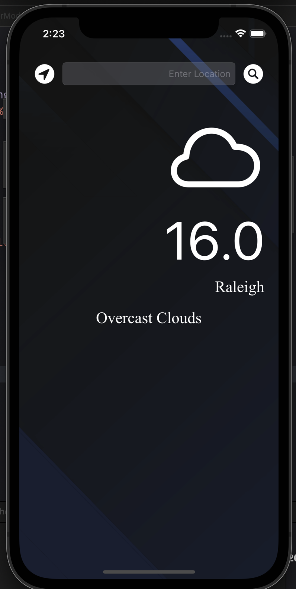
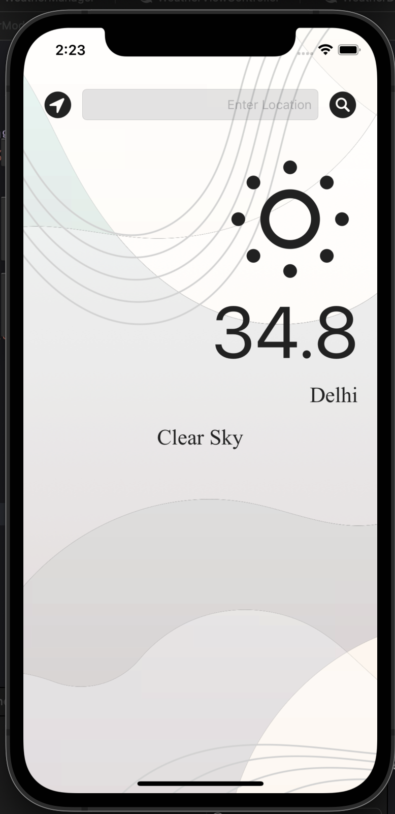

 

# WeatherNow
iOS Weather Application

## Description
User can enter their favorite location and get its temperature in Celsius. The application also shows a small description of the weather and a relevant icon that best describes the temperature.

## API 
https://openweathermap.org/api

## Screenshot

 
 
